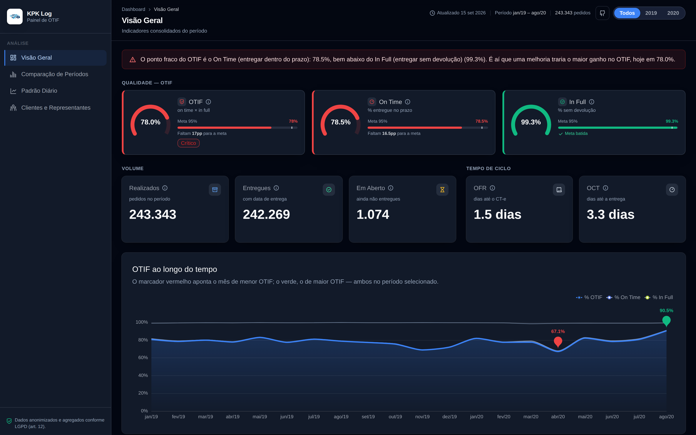
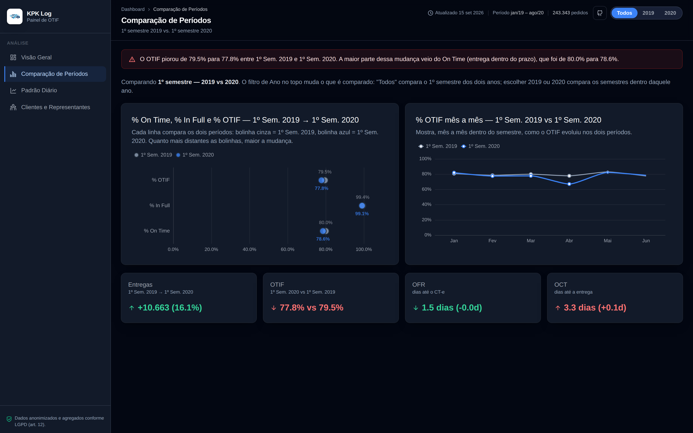
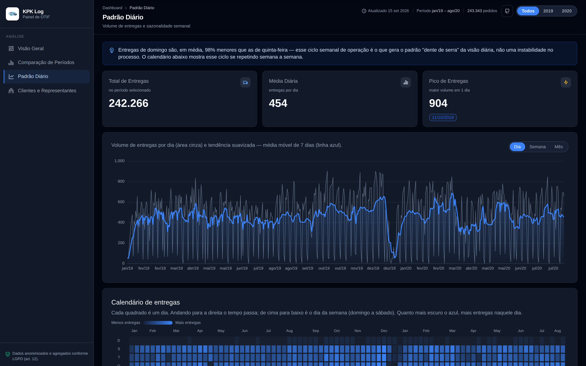
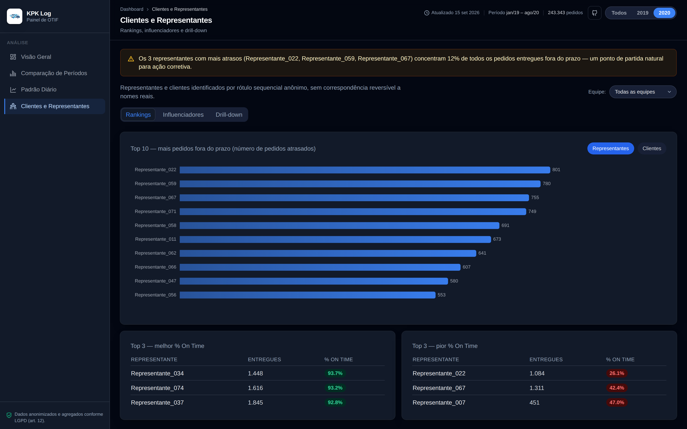

<div align="center">

</div>

<div align="center">

# 🚚 KPK Log — Dashboard de Logística e OTIF

**Dashboard web público que responde ao business case "Logística com Cálculo de OTIF"**,
substituindo a abordagem original em Power BI por um pipeline 100% Python + React —
construído do zero com IA (Claude Code), com anonimização de dados desde o design do
pipeline e cuidados de conformidade com a LGPD documentados abaixo (incluindo uma falha
que foi encontrada e corrigida).

[](https://kpk-log.vercel.app)
[](https://github.com/victor-ozores/KPK-Log)
[](./LICENSE)

[](https://linkedin.com/in/victor-ozores/)
[](https://app.xperiun.com/in/victor-ozores-2)
[](https://github.com/victor-ozores)

</div>

---

## 📌 Resumo

A KPK Log (transportadora fictícia) quer entender por que suas entregas nem sempre chegam
no prazo e sem avarias, e quais equipes/representantes/canais mais impactam esse resultado.
O indicador central é o **OTIF (On Time In Full)** — a fração de pedidos entregues dentro do
prazo **e** sem ocorrência de devolução.

**Resultado no período completo (jan/2019–ago/2020):** 243.343 pedidos, OTIF de **78,0%**.
O componente **On Time (78,5%)** é o gargalo — **In Full (99,3%)** já é praticamente
resolvido. O painel de influenciadores mostra que pedidos com OCT acima de 5 dias
praticamente nunca chegam no prazo, isolando onde o processo está falhando.

## 🔗 Ver Dashboard Online

[](https://kpk-log.vercel.app)

## 📢 Apresentação do Projeto

[](https://claude.ai/artifact/X9JdJJsVxyfCx2Bb1TYWaC)

---

## 💡 O Que Ele Responde

- Qual o OTIF geral e por ano, e qual dos dois componentes (On Time / In Full) é o gargalo
- Como o desempenho evoluiu mês a mês e o que mudou entre o 1º semestre de 2019 e de 2020
- Existe padrão por dia da semana ou sazonalidade nas entregas?
- Quais representantes e clientes concentram mais atrasos
- Quais fatores (tempo de ciclo, equipe, canal) mais influenciam o % On Time
- Drill-down: de Equipe → Representante → Cliente, para investigar qualquer combinação

As 23 perguntas originais do case foram respondidas uma a uma, cada resposta cruzada com o
dado exato do dashboard — ver [`notas/Solucao - Logistica com Calculo de OTIF.pdf`](./notas/Solucao%20-%20Logistica%20com%20Calculo%20de%20OTIF.pdf).
O business case original está em [`notas/Desafio Logistica com Calculo de OTIF.pdf`](./notas/Desafio%20Logistica%20com%20Calculo%20de%20OTIF.pdf).

## 📊 Páginas do Dashboard

| Seção | O que mostra |
|---|---|
| **Visão Geral** | KPIs gerais (OTIF, On Time, In Full, OFR, OCT), tendência mensal, filtro global de ano |
| **Comparação de Períodos** | H1 2019 vs. H1 2020 lado a lado, por indicador |
| **Padrão Diário** | Série diária de entregas com média móvel de 7 dias, sazonalidade por dia da semana |
| **Clientes e Representantes** | Rankings de atraso, influenciadores do % On Time e drill-down Equipe → Representante → Cliente |

## 📸 Preview

<div align="center">

<br><br>

<br><br>

<br><br>

</div>

<details>
<summary><b>⚙️ Detalhes Técnicos</b></summary>

### Arquitetura

```
BaseDados.xlsx (bruto, NÃO versionado)
        │
        ▼
  01_etl.py            → lê o Excel, monta o star schema
        │
        ▼
  02_anonimizacao.py   → substituição irreversível + generalização geográfica
        │
        ▼
  03_kpis.py            → calcula OTIF e demais indicadores
        │
        ▼
  04_export.py          → gera o único dashboard_data.json (com checagem anti-PII)
        │
        ▼
  dashboard_data.json (agregado, anonimizado, versionado)
        │
        ▼
  React + Vite + Tailwind + Tremor + Recharts  →  kpk-log.vercel.app
```

### Indicadores calculados

| Indicador | Fórmula |
|---|---|
| # Realizados | contagem de pedidos |
| # Entregues | pedidos com `DataEntrega` preenchida |
| # Em Aberto | pedidos sem `DataEntrega` |
| OFR | média de dias entre `DataPedido` e `DataEmissaoCTE` |
| OCT | média de dias entre `DataPedido` e `DataEntrega` |
| % On Time | entregues com `DataEntrega` ≤ `DataPrevistaEntrega` |
| % In Full | entregues sem ocorrência de devolução |
| % OTIF | % On Time × % In Full |

### Stack

- **Python + pandas** — ETL, anonimização e cálculo dos KPIs (`/scripts`)
- **React + Vite + Tailwind CSS + Tremor + Recharts** — dashboard estático em formato de
  app, com navegação por seções (não é uma página de rolagem única) (`/dashboard`)
- **pytest** — testes automatizados de cálculo, de ausência de PII e de consistência dos
  cortes por ano/hierarquia (`/tests`)
- **Vercel** — hospedagem estática gratuita

Todo o pipeline foi construído com o **Claude Code**, incluindo a decisão de anonimização
após inspeção real dos dados (ver seção abaixo).

### O dashboard como aplicação (não relatório)

O dashboard é um app de página única com:

- **Sidebar de navegação** entre 4 seções — troca de conteúdo sem recarregar a página.
- **Filtro global de Ano** (Todos/2019/2020) que recalcula os KPIs e gráficos das seções
  aplicáveis (a Comparação de Períodos é sempre H1 2019 vs H1 2020, por definição).
- **Drill-down clicável** Equipe → Representante → Cliente, com breadcrumb, na seção de
  Clientes e Representantes.
- **Tema claro/escuro** com preferência salva no navegador.

Isso exigiu adicionar ao `dashboard_data.json` (de forma aditiva, sem alterar nenhum campo
nem fórmula já existente) um corte `por_ano` e uma `hierarquia_drilldown` — ambos derivados
das mesmas funções de cálculo já testadas em `03_kpis.py`.

### Decisões de anonimização e LGPD

A base original (`BaseDados.xlsx`, 4 abas: Pedidos/Representante/Cliente/Cidade) **nunca é
commitada** — está no `.gitignore` desde o primeiro commit. Apenas o `dashboard_data.json`
final, já agregado e anonimizado, chega ao repositório público e ao frontend.

Inspecionando os dados brutos antes de decidir a técnica (em vez de assumir o pior ou o
melhor caso), encontramos:

- **`Cliente`** já chegava da fonte como rótulo sintético (`Cliente 10195`), sem nome real —
  mesmo assim, foi re-mapeado para um rótulo sequencial próprio (`Cliente_00001`...) para não
  expor o código interno original.
- **`Representante`** misturava códigos de rota/equipe (ex. `FLP-NOR`, `BNU-CEN`) com pelo
  menos um nome real de pessoa física. Como não é seguro confiar em heurística para separar
  "código" de "nome real", **todos** os 109 valores foram substituídos por rótulo sequencial
  estável (`Representante_001`...), eliminando o risco por completo.
- **`Cidade`**: municípios com poucos pedidos no período (< 30) foram generalizados para
  "Outras Cidades (agrupado)", evitando reidentificação cruzada (ex. um único representante
  atendendo uma cidade com 3 pedidos).

O drill-down Equipe → Representante → Cliente do dashboard expõe combinações com contagens
baixas (ex. 1 cliente com 1 pedido em um representante específico) sem gerar novo risco: como
`Representante`/`Cliente` já são rótulos anônimos sem mapa de reversão, não existe caminho
para ligar essa combinação a uma identidade real — a supressão por contagem mínima só é
necessária onde o dado ainda carrega significado real (como `Cidade`).

Os mapeamentos são **determinísticos** (por ordenação do código original), gerados em memória
a cada execução — não existe arquivo de-para salvo em disco que possa vazar a reversão.

Essa abordagem segue o **princípio baseado em risco da ANPD** para anonimização (LGPD art. 5,
XI e art. 12): uma vez que o dado perde a possibilidade de associação a um indivíduo por meios
razoáveis, ele sai do escopo da lei.

### Padrões aplicados

| Padrão | Onde |
|---|---|
| Pipeline determinístico e idempotente | `/scripts`, re-executável sem gerar drift |
| Testes automatizados (cálculo + anti-PII) | `/tests`, rodam via `pytest` |
| Fonte única de verdade | um único `dashboard_data.json` consumido pelo frontend |
| Dados brutos fora do controle de versão | `.gitignore` desde o primeiro commit |

### Limitações conhecidas

- Dataset fictício e estático (jan/2019–ago/2020) — o dashboard não recebe dados novos.
- Sem autenticação: por ser um case público, todas as seções são acessíveis a qualquer
  visitante.
- Drill-down e filtros rodam client-side sobre o JSON já agregado — não escala para bases
  muito maiores sem um backend/API.

### Estrutura do repositório

```
/scripts
  01_etl.py            → lê o Excel, monta o star schema
  02_anonimizacao.py   → substituição irreversível + generalização geográfica
  03_kpis.py           → calcula OTIF e demais indicadores
  04_export.py         → gera o único dashboard_data.json (com checagem anti-PII)
/tests                 → pytest: fórmulas de OTIF + ausência de PII
/data/processed        → saídas agregadas/anonimizadas (versionadas)
/data/raw              → intermediário com códigos originais (NÃO versionado)
/dashboard             → app React (Vite + Tailwind + Tremor + Recharts)
  src/components/shell    → sidebar, header, filtro de Ano, tema
  src/components/sections → Visão Geral, Comparação de Períodos, Padrão Diário,
                             Clientes e Representantes (rankings/influenciadores/drill-down)
/assets                → imagens usadas neste README
```

### Rodando localmente

```bash
pip install -r requirements.txt
python scripts/01_etl.py
python scripts/02_anonimizacao.py
python scripts/03_kpis.py
python scripts/04_export.py
pytest tests/ -v

cd dashboard
npm install
npm run dev
```

### Origem dos dados

Case educacional fictício, usado como exercício de modelagem de dados e cálculo de OTIF.

</details>

---

<div align="center">

Feito por **Victor Ozores** · [GitHub](https://github.com/victor-ozores)

</div>
